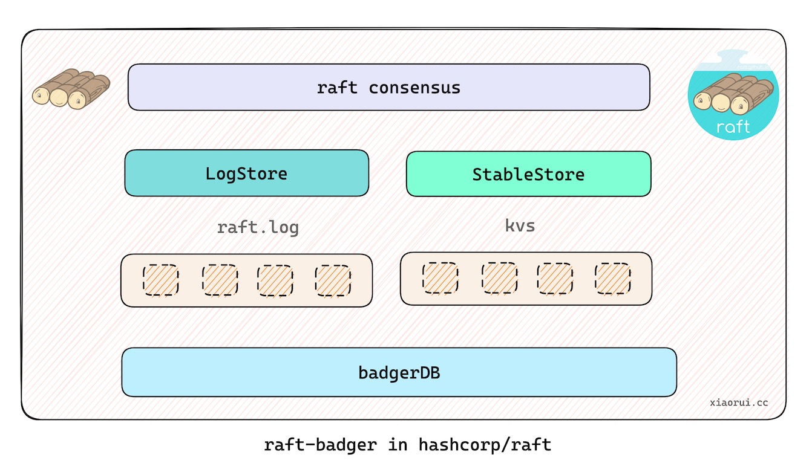

## raft-badger

`raft-badger` implements LogStore and StableStore Interface of `hashcorp/raft`.



**links**

- [badgerDB](https://github.com/dgraph-io/badger)
- [hashcorp-raft](https://github.com/hashicorp/raft)

### hashcorp api

#### hashcorp raft.LogStore

`raft-badger` implements LogStore interface of hashcorp/raft.

```go
type LogStore interface {
	// FirstIndex returns the first index written. 0 for no entries.
	FirstIndex() (uint64, error)

	// LastIndex returns the last index written. 0 for no entries.
	LastIndex() (uint64, error)

	// GetLog gets a log entry at a given index.
	GetLog(index uint64, log *Log) error

	// StoreLog stores a log entry.
	StoreLog(log *Log) error

	// StoreLogs stores multiple log entries.
	StoreLogs(logs []*Log) error

	// DeleteRange deletes a range of log entries. The range is inclusive.
	DeleteRange(min, max uint64) error
}
```

#### hashcorp raft.StableStore

`raft-badger` implements StableStore interface of hashcorp/raft.

```go
type StableStore interface {
	Set(key []byte, val []byte) error

	// Get returns the value for key, or an empty byte slice if key was not found.
	Get(key []byte) ([]byte, error)

	SetUint64(key []byte, val uint64) error

	// GetUint64 returns the uint64 value for key, or 0 if key was not found.
	GetUint64(key []byte) (uint64, error)
}
```

### installation

```
go get -u github.com/rfyiamcool/raft-badger
```

### usage with hashcorp-raft

```go
func main() {
	var (
		logStore raft.LogStore
		stableStore raft.StableStore
	)

	cfg = raftbadger.Config{
		DataPath: "/tmp/raft",
	}

	badgerDB, err := raftbadger.New(cfg, nil)
	if err != nil {
		return fmt.Errorf("fail to create new badger sotrage: %s", err)
	}

	logStore = badgerDB
	stableStore = badgerDB

	r, err := raft.NewRaft(config, (*fsm)(s), logStore, stableStore, snapshots, transport)
	...
}
```

### raft-badger usage

example code in `example/main.go`

```go
package main

import (
	"fmt"

	"github.com/hashicorp/raft"
	raftbadger "github.com/rfyiamcool/raft-badger"
)

func main() {
	cfg := raftbadger.Config{
		DataPath: "/tmp/raft",
	}
	store, err := raftbadger.New(cfg, nil)
	if err != nil {
		panic(fmt.Sprintf("failed to create raft badger storage, err: %s", err.Error()))
	}

	// test dropall api
	err = store.DropAll()
	checkError(err)

	// test set api
	err = store.Set([]byte("blog"), []byte("xiaorui.cc"))
	checkError(err)

	// test get api
	value, err := store.Get([]byte("blog"))
	checkError(err)
	fmt.Println("value is ", string(value))

	// test SetUint64 api
	err = store.SetUint64([]byte("index"), 111)
	checkError(err)

	// test GetUint64 api
	index, err := store.GetUint64([]byte("index"))
	checkError(err)
	fmt.Println("index is ", index)

	var logs []*raft.Log
	for i := 0; i < 20; i++ {
		logs = append(logs, &raft.Log{
			Index: uint64(i),
			Term:  10,
			Type:  0,
			Data:  []byte("a"),
		})
	}

	// test StoreLogs api
	err = store.StoreLogs(logs)
	checkError(err)

	for i := 0; i < 10; i++ {
		logptr := new(raft.Log)
		err = store.GetLog(uint64(i), logptr)
		checkError(err)
		fmt.Printf("the index of the No.%v log is %v\n", i, logptr.Index)
	}

	err = store.DeleteRange(0, 10)
	checkError(err)

	for i := 0; i < 10; i++ {
		logptr := new(raft.Log)
		err = store.GetLog(uint64(i), logptr)
		if err != nil {
			fmt.Printf("not found the No.%v log\n", i)
		}
		if err == nil {
			panic(fmt.Sprintf("found No.%v log, but tne log is deleted \n", i))
		}
	}

	logptr := new(raft.Log)
	err = store.GetLog(11, logptr)
	checkError(err)
	fmt.Printf("get No.11 log, index is %v\n", logptr.Index)
}

func checkError(err error) {
	if err != nil {
		panic(err)
	}
}
```